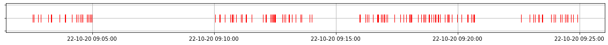

# X-ray bursters

## Генератор событий  

Принимаемые параметры - `m, intervals`

`m` - число событий в cекунлу

`intervals` - список интервалов по времени

Формат даты `%Y-%m-%d %H:%M:%S.%f` (2020-10-22 14:29:51.708055)
```
a = Events(0.5, [['2020-10-22 08:15:27.243860','2020-10-22 08:17:00.713311'],['2020-10-22 08:17:59.123542','2020-10-22 08:21:06.957365'],['2020-10-22 08:21:27.443803','2020-10-22 08:25:13.811805']])
plot(a.events)
```

