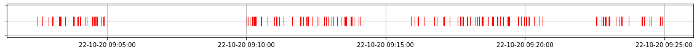
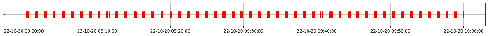

# X-ray bursters

## Генератор событий  

Принимаемые параметры - `m, intervals`

`m` - число событий в cекунлу

`intervals` - список интервалов по времени

`period1` - длительность сигналов

`period2` - длительность паузы

Формат даты `%Y-%m-%d %H:%M:%S.%f` (2020-10-22 14:29:51.708055)
```
from event_generator import Events
a = Events(1/6, [['2020-10-22 09:00:00.000000','2020-10-22 09:05:00.000000'],['2020-10-22 09:10:00.000000','2020-10-22 09:25:00.000000']], 300, 100)
plot(a.events)
```




## Фазовая распределение событий
```
a = Events(1, [['2020-10-22 09:00:00.000000','2020-10-22 10:00:00.000000']], 23, 50)
plot(a.events)
evnts = np.array(a.events_in_seconds)
```



```
period = 73
n, bins, patches = plt.hist(evnts%period/period, 100, range=(0,1))
plt.xlabel('Phase')
plt.ylabel('Number of events')
plt.show()
```


