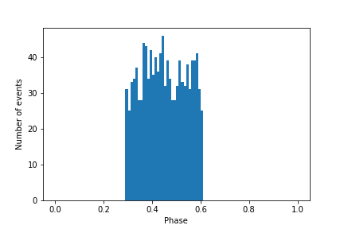
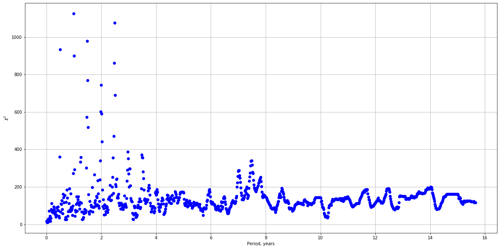

# X-ray bursters

## Генератор событий  

Принимаемые параметры - `m, intervals`

`m` - число событий в cекунлу

`intervals` - список интервалов по времени

`shape_function` - форма сигнала

`period1` - длительность сигналов

`period2` - длительность паузы

Формат даты `%Y-%m-%d %H:%M:%S.%f` (2020-10-22 14:29:51.708055)
```
from event_generator import Events
a = Events(1/6, [['2020-10-22 09:00:00.000000','2020-10-22 09:05:00.000000'],['2020-10-22 09:10:00.000000','2020-10-22 09:25:00.000000']], 300, 100)
plot(a.events)
```


## Фазовое распределение событий
```
a = Events(1, [['2020-10-22 09:00:00.000000','2020-10-22 10:00:00.000000']], 23, 50)
plot(a.events)
evnts = np.array(a.events_in_seconds)
```


```
period = 73
n, bins, patches = plt.hist(evnts%period/period, 100, range=(0,1))
plt.xlabel('Phase')
plt.ylabel('Number of events')
plt.show()
```



```
period = 80
n, bins, patches = plt.hist(evnts%period/period, 100, range=(0,1))
plt.xlabel('Phase')
plt.ylabel('Number of events')
plt.show()
```


## Поиск периодичностей

```
from search_period import periods_statistic
per, stat, stat1, stat2 = periods_statistic(evnts_sin, intrvls, 5, 10, 200)
```


```
per, stat, stat1, stat2 = periods_statistic(evnts, intrvls, 5, 10*24*3600, 12*24*3600)
```




## С учетом "дыр"

```
time_intervals = [['2020-11-25 00:00:00.000000','2020-11-25 12:00:00.000000'], ['2020-11-25 18:00:00.000000','2020-11-26 00:00:00.000000'], ['2020-11-26 18:00:00.000000','2020-11-28 18:00:00.000000'], ['2020-11-29 18:00:00.000000','2020-12-01 18:00:00.000000'],]

b = Events(1/(5*60), time_intervals, sin_signal1, 0, 12*3600)
evnts1 = np.array(b.events_in_seconds)
intrvls1 = np.array(b.intervals_in_seconds)

per_b, stat_b, stat1_b, stat2_b = periods_statistic(evnts1, intrvls1, 5, 5*3600, 15*3600)
```


## Пример

Наблюдения проводятся каждый день 22:00-02:00 с 
01.11.2020 по 01.04.2021 22:00 


